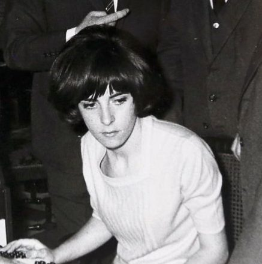

# Contribución De La Mujer a la Computación

## Descripción

En este proyecto veremos a diferentes mujeres que han colaborado al mundo de la computación en la historia.

## Contenidos

Hedy Lamarr
- [Hedy Lamarr](HedyLamarr/hedyLamarr.md)

Radia Joy Perlman
- [Radia Joy Perlman](RadiaPerlman/radiaPerlman.md)

Joan Clarke
- [Joan Clarke](JoanClarke/joanClarke.md)

Grace Murray
- [Grace Murray](GraceMurray/graceMurray.md)

Ana María Prieto
- [Ana María Prieto](AnaPrieto/anaPrieto.md)

## Referencias
- [Hedy Lamarr](https://es.wikipedia.org/wiki/Hedy_Lamarr)
- [Radia Joy Perlman](https://es.wikipedia.org/wiki/Radia_Perlman)
- [Joan Clarke](https://es.wikipedia.org/wiki/Joan_Clarke)
- [Grace Murray](https://es.wikipedia.org/wiki/Grace_Murray_Hopper)
- [Ana María Prieto](https://haycanal.com/noticias/10473/ocho-mujeres-pioneras-en-el-desarrollo-de-la-ciencia-y-la-tecnologia-en-espana)

## Licencia

